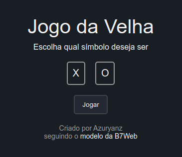
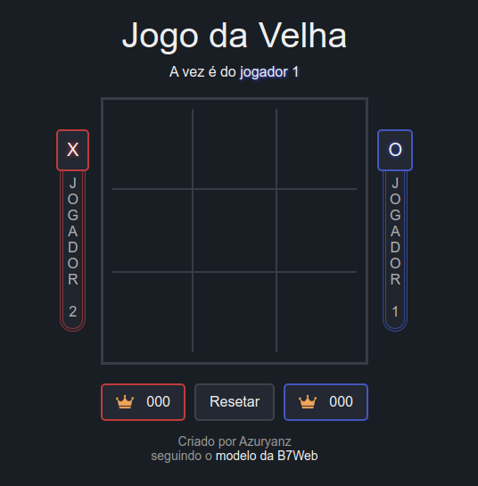
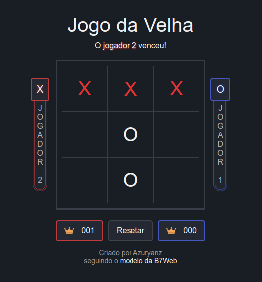
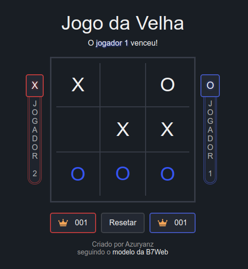
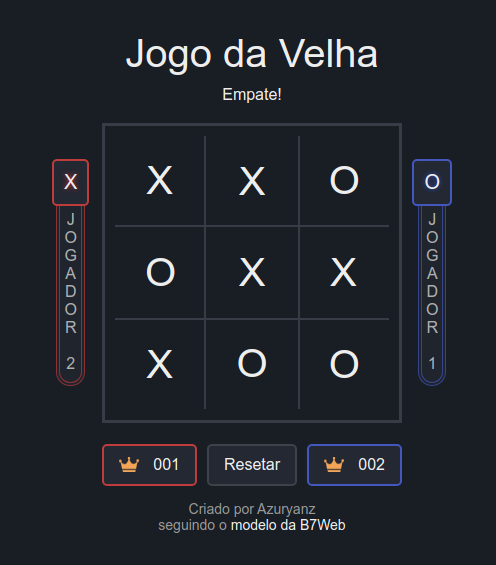

<h1 align="center">Jogo da Velha</h1>

## Sobre o Projeto
O projeto original é de autoria da B7Web, e a vídeo-aula mostrando como desenvolver o projeto base pode ser encontrada [aqui](https://alunos.b7web.com.br/curso/javascript/d7js-projeto-4-jogo-da-velha).

Todo o **HTML** e **CSS** foi desenvolvido por conta própria, enquanto o **JavaScript** foi adapatado do orignal, para funcionar com a forma com a qual os restante do código foi feito.

Para ir além do projeto original, os seguintes elementos foram adicionados a este projeto:
- "tela inicial" para o usuário selecionar com qual símbolo deseja jogar (*X* ou *O*);
- pequenas animações para organizar os elementos da tela;
- contador de vitórias para a "sessão" atual do jogo;
- divisão de cores entre os jogadores;
- confirmação visual ao se atingir uma das combinações de vitória

## Como utilizar
### Abrindo o arquivo
Uma vez que o projeto utiliza apenas de HTML, CSS e JavaScript, basta o usuário abrir o arquivo **index.html** em um navegador, que tela da bateria será carregada.

O termo **modelo da B7Web** é clicável, e redireciona para a vídeo-aula do projeto.

### Jogadores
Como o intuito do projeto era apena desenvolver as habilidades de Html, Css e Javascript, o único modo de jogo é *Jogador X Jogador*, de forma local.

Os jogadores devem alternar o controle do mouse a cada turno.

### Tela de Seleção

Uma vez carregado o arquivo no navegador, o usuário deverá escolher com qual símbolo jogar: **X** ou **O**. Enquanto estiver selecionando, o símbolo adquirirá um contorno azulado. 

Uma vez que a seleção esteja confirmada, uma breve animação ocorrerá, abrindo o tabuleiro do jogo e posicionando os elementos na tela.

### Jogando

Um vez iniciada a *sessão*, o tabuleiro será carregado, e os jogadores serão posicionados em tela:
- O usuário é o **jogador 1**, representado pela cor azul  `#4357BF` na tela.
- O oponente é o **jogador 2**, representado pela cor vermelha  `#be3c3c` na tela.

Logo abaixo do título **Jogo da Velha**, há a **instrução atual** do jogo. Essa instrução é atualizada a cada jogada, informando de quem é a vez de jogar, e o resultado da partida.

A escolha de qual jogador começa é **aleatória**.

### Resultados

Caso o *jogador 2* atinja uma condição de vitória, os símbolos correspondentes serão coloridos de *vermelho*, e mais nenhuma jogada poderá ser feita nesta rodada.

Caso o *jogador 1* atinja a condição de vitória, o esmo acontecerá, com os símbolos sendo coloridos de uma cor *azul*.

Em ambos estes casos, o respectivo contador de vitórias será incrementado.

Caso todas as posição do tabuleiro sejam preenchidas, sem que um jogador tenha ganho, o resultado será um empate: nenhum símbolo é colorido e nenhum jogador pontua.

### Resetando o Tabuleiro

Para começar um novo jogo, basta ao usuário clicar no botão **Resetar**, que todos os campos serão limpos e a partida recomeçará, mantendo o contador de vitórias de cada jogador.

### Recomeçando a Sessão

Para recomeçar do zero, com o usuário escolhendo um novo símbolo e **zerando** os contadores de vitória, deve-se **recarregar** a página.